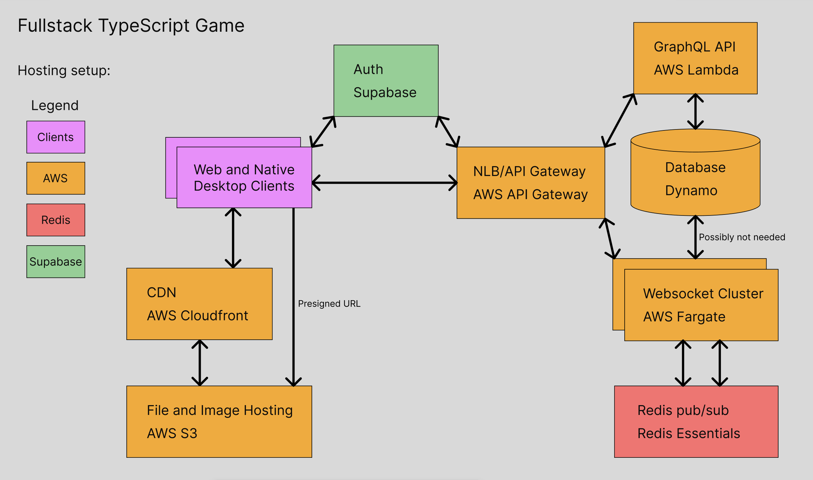

# ts-real-time-online-game-template

A template for creating real time, online games using TypeScript! Quickly create mmo-style games using React + Phaser for rendering, Colyseus for websockets, Electron for native builds, and SST (IaC) for deployment!

## Developer Quickstart

This project uses Turborepo to manage scripts across the monorepo. You can install it with:
```
npm i -g turbo
```

Take a look at the structure as well as the available commands:
```
turbo ls
turbo run
```

Then you can either run:
```
turbo run <script>
```
OR:
```
pnpm dev
pnpm lint
pnpm build
```

## Hosting setup

The goal is to provide Infrastructure as Code (IaC) for hosting a scalable, cheap setup:


